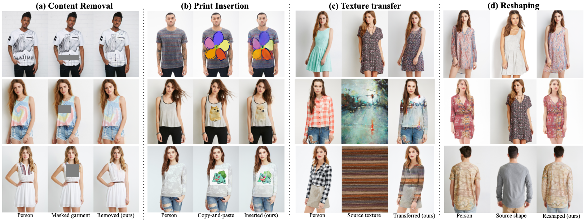

## Get Started for Bash Scripts
### DeepFashion Dataset Setup
To set up the dataset in your specified data folder ```$DATA_ROOT```, run:
```
pip install --upgrade gdown
python tools/download_deepfashion_from_google_drive.py --dataroot $DATA_ROOT
```
This script will automatically download all the necessary data from Google Drives (
    [images source](https://github.com/yumingj/DeepFashion-MultiModal), [parse source](https://drive.google.com/file/d/1OAsHXiyQRGCCZltWtBUj_y4xV8aBKLk5/view?usp=share_link), [annotation source](https://drive.google.com/drive/folders/1BX3Bxh8KG01yKWViRY0WTyDWbJHju-SL)) to your the specified ```$DATA_ROOT``` in desired format.

### Environment Setup
Please install the environment based on your need.
 
#### 1. __Environment for Inference or Test (for metrics) Only__
Required packages are
```
torch
torchvision
tensorboardX
scikit-image==0.16.2
```
The version of torch/torchvison is not restricted for inference.

#### 2. __Environment for Training__
Note the training process requires CUDA functions provided by [GFLA](https://github.com/RenYurui/Global-Flow-Local-Attention), which can only compile with __torch=1.0.0__.

To start training, please follow the [installation instruction in GFLA](https://github.com/RenYurui/Global-Flow-Local-Attention) to install the environment. 

Then run ```pip install -r requirements.txt```.

### Download pretrained weights
The pretrained weights can be found [here](https://drive.google.com/drive/folders/1-7DxUvcrC3cvQV67Z2QhRdi-9PMDC8w9?usp=sharing). Please unzip them under ```checkpoints/``` directory.

*(The checkpoints above are reproduced, so there could be slightly difference in quantitative evaluation from the reported results. To get the original results, please check our released generated images [here](https://drive.google.com/drive/folders/1GOQVMhBKvANKutLDbzPbE-Zrb6ai9Eo8?usp=sharing).)*

*(```DIORv1_64``` was trained with a minor difference in code, but it may give better visual results in some applications. If one wants to try it, specify ```--netG diorv1```.)*

---
## Training

__Warmup the Global Flow Field Estimator__

Note, if you don't want to warmup the Global Flow Field Estimator, you can extract its weights from GFLA by downloading the pretrained weights GFLA from [here](https://github.com/RenYurui/Global-Flow-Local-Attention). (Check Issue [#23](https://github.com/cuiaiyu/dressing-in-order/issues/23) for how to extract weights from GFLA.)

Otherwise, run

```
sh scripts/run_pose.sh
```

__Training__

After warming up the flownet, train the pipeline by
```
sh scripts/run_train.sh
```
Run ```tensorboard --logdir checkpoints/$EXP_NAME/train``` to check tensorboard.

*Note: Resetting discriminators may help training when it stucks at local minimals.*

----
## Evaluations

__Download Generated Images__ 

Here are our generated images which are used for the evaluation reported in the paper. (Deepfashion Dataset) 
- [\[256x176\]](https://drive.google.com/drive/folders/1GOQVMhBKvANKutLDbzPbE-Zrb6ai9Eo8?usp=sharing)
- [\[256x256\]](https://drive.google.com/drive/folders/1GOQVMhBKvANKutLDbzPbE-Zrb6ai9Eo8?usp=sharing)

__SSIM, FID and LPIPS__

To run evaluation (SSIM, FID and LPIPS) on pose transfer task: 
```
sh scripts/run_eval.sh
```
please always specific ```--frozen_flownet``` for inference.

---
## Cite us!
If you find this work is helpful, please consider starring :star2: this repo and citing us as
```
@InProceedings{Cui_2021_ICCV,
    author    = {Cui, Aiyu and McKee, Daniel and Lazebnik, Svetlana},
    title     = {Dressing in Order: Recurrent Person Image Generation for Pose Transfer, Virtual Try-On and Outfit Editing},
    booktitle = {Proceedings of the IEEE/CVF International Conference on Computer Vision (ICCV)},
    month     = {October},
    year      = {2021},
    pages     = {14638-14647}
}
```
## Acknowledgements
This repository is built up on [GFLA](https://github.com/RenYurui/Global-Flow-Local-Attention),
[pytorch-CycleGAN-and-pix2pix](https://github.com/junyanz/pytorch-CycleGAN-and-pix2pix), 
[PATN](https://github.com/tengteng95/Pose-Transfer) and 
[MUNIT](https://github.com/NVlabs/MUNIT). Please be aware of their licenses when using the code. 

Thanks a lot for the great work to the pioneer researchers!
